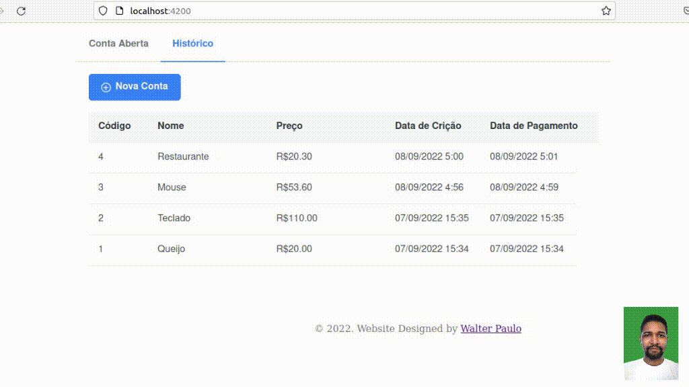

# Conta JA

### Front-end
* Angular 14.2.1 - [https://angular.io/](https://angular.io/);
* Prime NG 14.0.2 - [https://www.primefaces.org/primeng/](https://www.primefaces.org/primeng/);

Contas a pagar, despesas.


## Inicia o projeto

```s
ng serve
```

## Instalação de pacotes

```s
npm install
```
> Se iniciou o projeto `ng serve` abre o navegador no endereço `http://localhost:4200/`

## Build
```s
ng build --watch --configuration development
```

## Iniciar Teste
```s
ng test
```


[Video](https://youtu.be/qnXomTVtSBM)
